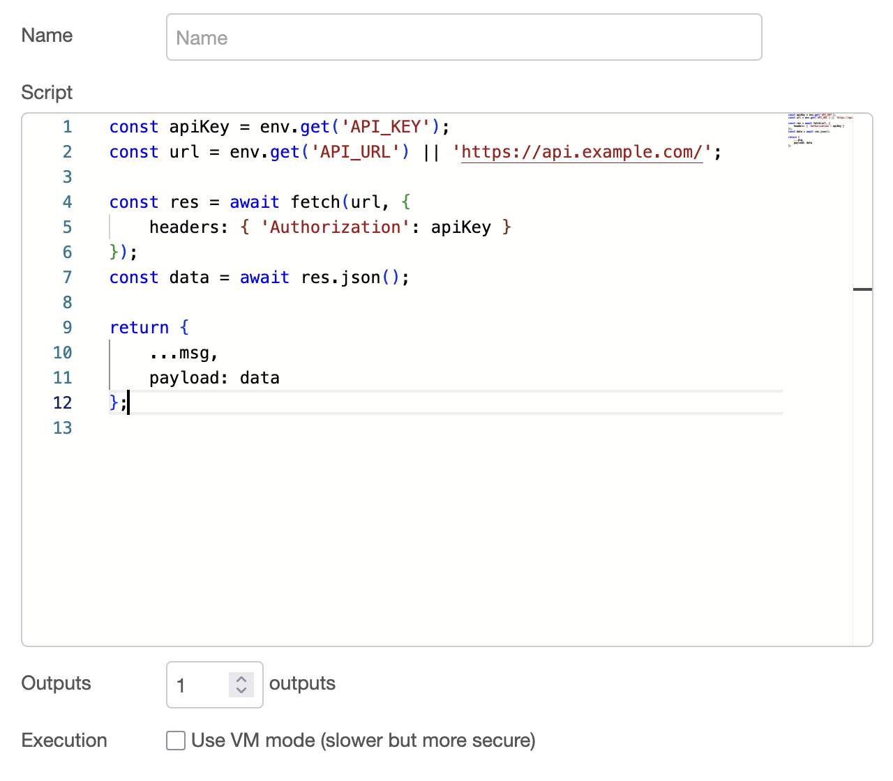

# Node-RED TypeScript Node

A fast TypeScript execution node for Node-RED with Monaco editor and type checking.

## Installation

Install via Node-RED palette manager by searching for `node-red-contrib-ts`

Or via npm:
```bash
npm install node-red-contrib-ts
```

## TypeScript Node

Execute TypeScript code directly in your Node-RED flows with full type checking and modern JavaScript features.

### Features

- **Monaco Editor** - Same editor as VS Code with syntax highlighting and IntelliSense
- **TypeScript Support** - Full TypeScript compilation with error checking
- **Async/Await Ready** - Your code runs in an async function context
- **Multiple Outputs** - Route messages to different outputs (1-10)
- **Two Execution Modes** - Function mode (fast) or VM mode (secure)


### Performance Benchmark

Benchmark results for 500,000 executions:
- **Node-RED function node**: 11,886ms
- **TypeScript node (Function mode)**: 6,177ms - **1.9x faster**
- **TypeScript node (VM mode)**: 10,222ms - **1.2x faster**


### Available Context

Your TypeScript code has access to these variables:

- `msg` - The incoming message object
- `node` - The current node instance for logging
- `RED` - Node-RED API
- `global` - Global context storage
- `env` - Environment variables via `env.get('VAR_NAME')`
- `fs`, `path`, `os`, `crypto`, `util`, `Buffer` - Node.js modules
- `fetch` - HTTP client for API calls
- `process` - Process information

### Usage

**API call with error handling:**
```typescript
try {
    const apiKey = env.get('API_KEY');
    const response = await fetch('https://api.example.com/data', {
        headers: { 'Authorization': `Bearer ${apiKey}` }
    });
    
    if (!response.ok) {
        throw new Error(`API error: ${response.status}`);
    }
    
    msg.payload = await response.json();
    return msg;
} catch (error) {
    node.error(error.message);
    return null;
}
```

### Configuration

- **Script** - Your TypeScript code in the Monaco editor
- **Outputs** - Number of outputs (1-10)
- **Execution Mode** - Function mode (faster) or VM mode (more secure)



### Editor Features

- **IntelliSense** - Auto-completion for available context variables
- **Error Detection** - Real-time TypeScript error checking
- **Syntax Highlighting** - Full TypeScript syntax support
- **Template Code** - Helpful starter template for new nodes

## License

This project is licensed under the LGPL-3.0 License - see the [LICENSE](LICENSE) file for details.

You are free to use this software in commercial environments and modify it, but any modifications must be shared under the same license.
